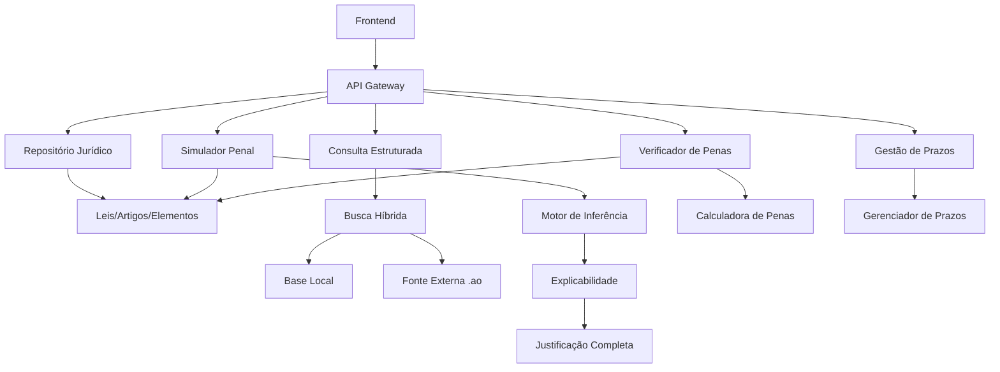

# Plano de Reestruturação do Sistema Penal de Angola

## Visão Geral
Reestruturar completamente o sistema Penal de Angola com foco no **Simulador de Enquadramento Penal com Explicabilidade** como grande diferencial.

## Análise do Estado Atual

### ✅ Componentes já existentes:
- **Entidades**: Lei, Artigo, ElementoJuridico, Penalidade, CategoriaCrime, AiExplanations
- **Repositories**: Completos com queries de busca
- **LeiService**: CRUD completo de legislação
- **BuscaSemanticaService**: Busca com TF-IDF e dicionário jurídico
- **BuscaOnlineService**: Fallback simulado com Código Penal Angolano

### 🔄 Componentes a criar/expandir:
- Simulador Penal com motor de inferência
- Verificador de Penas
- Gestão de Prazos
- Busca híbrida com domínios angolanos

---

## FASE 1: Repositório Jurídico (Base para tudo)

### 1.1 - Reutilizar estrutura existente
- [ ] Lei (existente ✅)
- [ ] Artigo (existente ✅)
- [ ] ElementoJuridico (existente ✅)
- [ ] Penalidade (existente ✅)
- [ ] CategoriaCrime (existente ✅)

### 1.2 - Novas entidades
- [ ] **Circunstancia** - Circumstâncias agravantes/atenuantes
- [ ] **TipoCrime** - Catálogo de tipos de crimes
- [ ] **RegraPenal** - Regras de aplicação de penas

### 1.3 - Expansão do serviço
- [ ] LeiService: adicionar endpoints de busca avançada
- [ ] ArtigoRepository: adicionar busca por categoria crime
- [ ] ElementoJuridicoRepository: buscar por tipo (qualificadoras, causas de aumento)

---

## FASE 2: Verificador de Penas

### 2.1 - Novo serviço: VerificadorPenasService
```java
// Entrada: crime + circunstâncias
// Saída: pena calculada com base legal
public VerificacaoPenaResult verificarPena(
    TipoCrime crime,
    List<Circunstancia> circunstancias,
    boolean flagrante
)
```

### 2.2 - Lógica de cálculo
- [ ] Pena base (artigo principal)
- [ ] Aplicação de agravantes (aumento %)
- [ ] Aplicação de atenuantes (diminuição %)
- [ ] Concurso de crimes (soma ou absorção)
- [ ] Flagrante (redução automática)

### 2.3 - Novo controller
- [ ] VerificadorPenasController
- [ ] POST /api/verificador/calcular

---

## FASE 3: Simulador Penal com Explicabilidade

### 3.1 - Novo serviço: SimuladorPenalService
```java
// Grande diferencial do sistema
public SimulacaoResult simular(
    DescricaoCaso descricao,
    List<Fato> fatos,
    List<Circunstancia> circunstancias
)

// Retorna:
// - Lista de crimes possíveis (concurso)
// - Artigo aplicável
// - Justificação passo a passo
// - Pena prevista
// - Base legal
```

### 3.2 - Motor de inferência baseado em regras
- [ ] Engine de matching fatos → elementos jurídicos
- [ ] Sistema de pontuação para crimes
- [ ] Resolução de concurso de crimes

### 3.3 - Explicabilidade completa
- [ ] ExplicacaoPasso: artigo, elemento, matched, justificativa
- [ ] ExplicacaoCompleta: lista de passos, conclusão

### 3.4 - Novo controller
- [ ] SimuladorPenalController
- [ ] POST /api/simulador/enquadrar

---

## FASE 4: Gestão de Prazos

### 4.1 - Nova entidade: Prazo
- [ ] Tipo prazo (investigação, instrução, julgamento)
- [ ] Data início, data fim
- [ ] Status (ativo, cumprido, violado)
- [ ] Processo relacionado

### 4.2 - Novo serviço: GestaoPrazosService
- [ ] Calcular prazos automáticos
- [ ] Notificações de proximidade
- [ ] Histórico de alterações

### 4.3 - Novo controller
- [ ] PrazoController
- [ ] CRUD completo

---

## FASE 5: Busca Híbrida com Domínios Angolanos

### 5.1 - Expandir BuscaOnlineService
- [ ]site:gov.ao
- [ ]site:diariodarepublica.ao
- [ ]site:tribunalsupremo.ao
- [ ] Marcar resultados como "não verificados"

### 5.2 - Implementar busca real (futuro)
- [ ] Conectar com APIs reais (Dário da República)
- [ ] Web scraping de tribunais

---

## FASE 6: Frontend - Novas Páginas

### 6.1 - Estrutura de rotas
```
/simulador          - Simulador Penal
/verificador        - Verificador de Prazos
/prazos             - Gestão de Prazos
/consulta           - Consulta Estruturada
```

### 6.2 - Componentes
- [ ] SimuladorForm - entrada de caso
- [ ] ResultadoExplicavel - exibição com justificativa
- [ ] VerificadorPenas - entrada crime + circunstâncias
- [ ] ListaPrazos - gestão de prazos

---

## Arquitetura de Dados

### Tabelas principais:
```sql
-- leis (existente)
-- artigos (existente)
-- elementos_juridicos (existente)
-- penalidades (existente)
-- categorias_crime (existente)

-- NOVAS --
circunstancias (id, tipo, descricao, percentual)
tipos_crime (id, nome, categoria_id)
regras_penal (id, artigo_id, regra_json)
prazos (id, tipo, data_inicio, data_fim, status, processo_id)
```

---

## Diagrama de Arquitetura



---

## Próximos Passos

1. **Confirmar plano** com o utilizador
2. **Iniciar FASE 1**: Ajustar entidades existentes se necessário
3. **Iniciar FASE 2**: Implementar Verificador de Penas
4. **Iniciar FASE 3**: Implementar Simulador Penal (diferencial)
5. **Iniciar FASE 4**: Gestão de Prazos
6. **Iniciar FASE 5**: Busca híbrida
7. **Iniciar FASE 6**: Frontend
